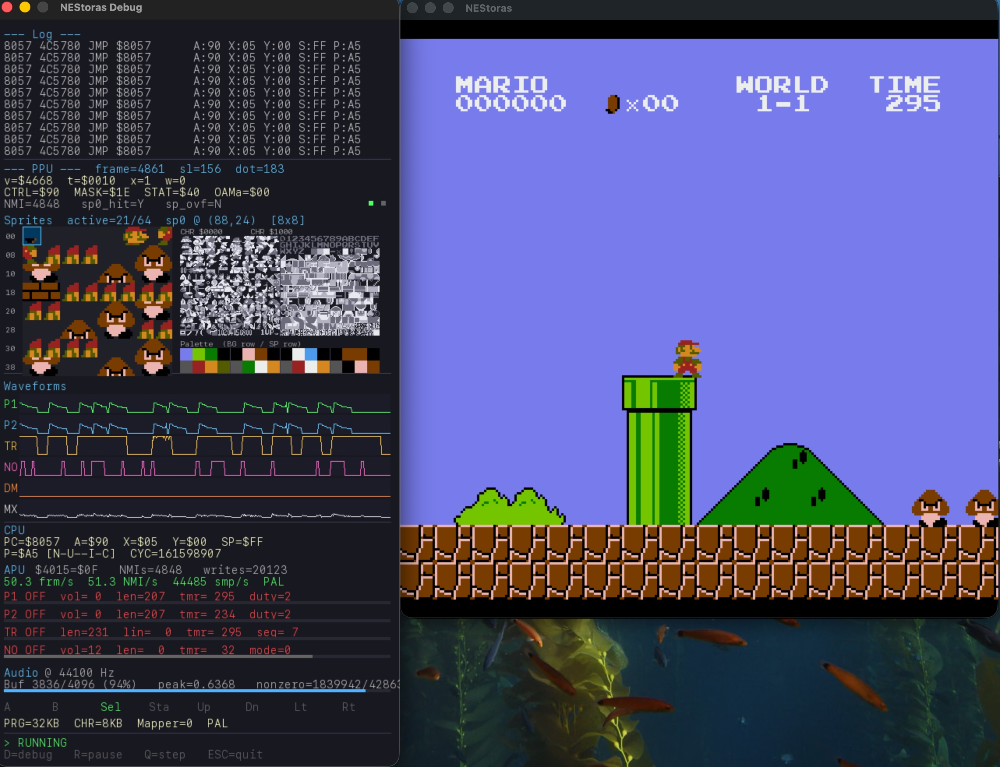
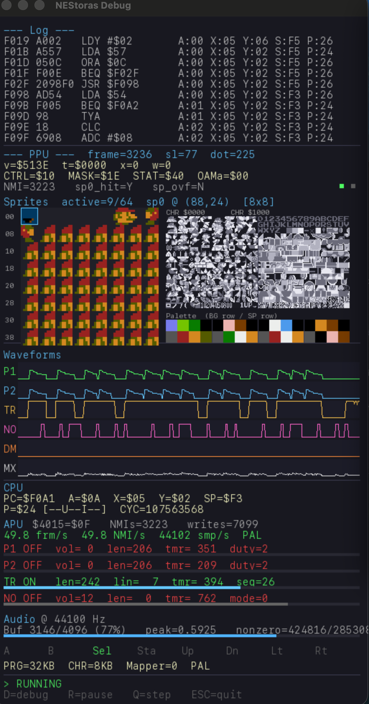

# NEStoras [](https://sonarcloud.io/summary/new_code?id=IlisianStudios_NEStoras)

A NES (Nintendo Entertainment System) emulator written in **C** with SDL2 including a debugger.



## Supported Mappers


| Mapper | Name | Supported Games                                          |
| ------ | ---- | -------------------------------------------------------- |
| 0      | NROM | [Supported games](https://nesdir.github.io/mapper0.html) |

## Status


| Subsystem                             | State                                                        |
| ------------------------------------- | ------------------------------------------------------------ |
| CPU (Ricoh 2A03 / 6502)               | Working — passes`nestest.nes`                               |
| Memory bus + mirroring                | Working                                                      |
| Controller 1 (keyboard)               | Working                                                      |
| iNES ROM loading                      | Working                                                      |
| Mapper 0 (NROM)                       | Working                                                      |
| Other mappers (MMC1, MMC3, UxROM, …) | Not yet                                                      |
| APU (pulse 1/2, triangle, noise, DMC) | Working — audio via SDL2                                    |
| PPU (Ricoh 2C02)                      | Working — cycle-accurate, catch-up step model               |
| OAMDMA (`$4014`)                      | Working                                                      |
| Sprite 0 hit / sprite overflow        | Working                                                      |
| NTSC + PAL timing                     | Working                                                      |
| Save states                           | Not yet                                                      |
| Built-in debug window                 | Working (PPU panel, sprite viewer, CHR + palette, APU scope) |

SMB plays through. See [PPU_SPEC.md](PPU_SPEC.md) for the PPU design notes.

## Build 

Requires SDL2, SDL2_ttf, CMake, and a C11 compiler.

```bash
# macOS
brew install cmake sdl2 sdl2_ttf
xcode-select --install

# Build
cmake -S . -B build
cmake --build build
```

If CMake can't find SDL2, point it explicitly:

```bash
cmake -S . -B build \
  -DCMAKE_PREFIX_PATH="$(brew --prefix sdl2);$(brew --prefix sdl2_ttf)"
```

## Run

Drop a `.nes` file onto the window, or pass it as a command-line argument:

```bash
./build/NEStoras path/to/rom.nes
```

In a debug build the emulator auto-loads `nestest.nes` from the build directory
and opens the debug window. Press `Esc` to quit.

## Controls


| Key        | NES Button |
| ---------- | ---------- |
| Z          | A          |
| X          | B          |
| Shift      | Select     |
| Enter      | Start      |
| Arrow keys | D-pad      |

Emulator controls:


| Key | Action                                  |
| --- | --------------------------------------- |
| D   | Toggle debug window                     |
| R   | Pause / resume CPU                      |
| Q   | Step one CPU instruction (while paused) |
| Esc | Quit                                    |

The debug window shows: CPU instruction log, PPU state (frame/scanline/dot,
Loopy `v`/`t`/`x`/`w`, CTRL/MASK/STAT, NMI count, sprite-0-hit/overflow
flags), a visual 64-sprite OAM viewer, both CHR pattern tables, the palette
RAM as colour swatches, APU per-channel scopes (P1/P2/TRI/NOI/DMC + mix), and
the channel/length/volume state for each APU voice.



## Documentation


| Document                             | Contents                                                                                                                     |
| ------------------------------------ | ---------------------------------------------------------------------------------------------------------------------------- |
| [DESIGN.md](DESIGN.md)               | Hardware reference: CPU/PPU/APU specs, memory maps, register tables, CPU implementation walkthrough, development roadmap     |
| [PPU_SPEC.md](PPU_SPEC.md)           | PPU implementation spec — cycle-accurate dot stepping, sprite evaluation, the catch-up integration model, debug-window plan |
| [nes_apu_guide.md](nes_apu_guide.md) | APU implementation notes                                                                                                     |

## Project Layout

```
include/          public headers (one per subsystem)
src/              implementation
  main.c              SDL setup, main loop, event handling
  cpu.c               6502 core, run_cycles, NMI/IRQ service
  instruction.c       6502 opcode table + addressing modes
  bus.c               extern CPU-bus globals (RAM, controllers)
  cartridge.c         iNES parser
  mappers.c           Mapper 0 (NROM)
  ppu.c               2C02 PPU — fetch pipeline, sprites, scrolling
  apu.c               2A03 APU — channels, frame counter, mixer
  timing.c            audio-sync throttle
  ringbuffer.c        lock-free audio ring buffer
  debug_window.c      SDL2_ttf debug overlay
testroms/         test ROMs (nestest, blargg tests, etc.)
testlog/          nestest.log for compare-mode validation
```
